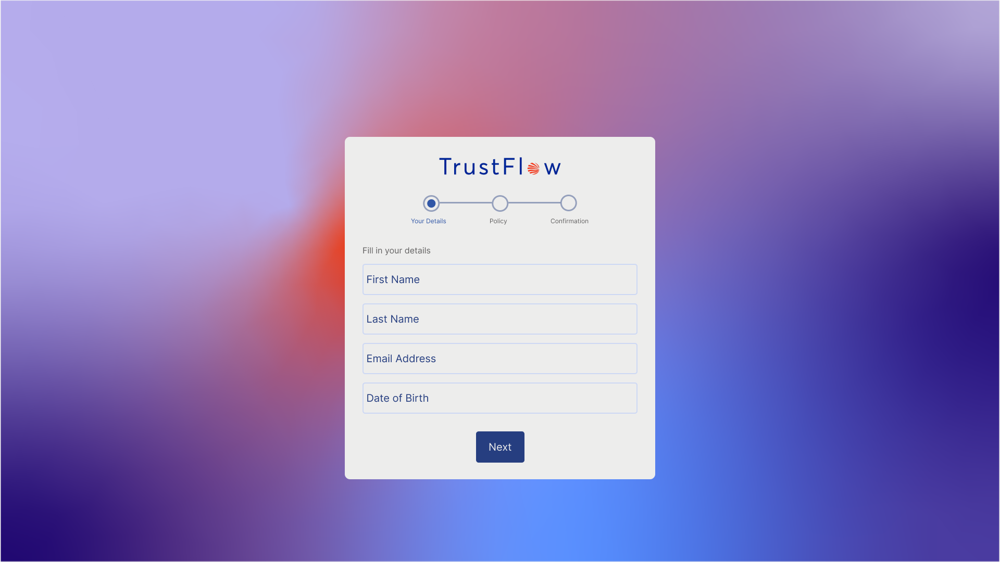
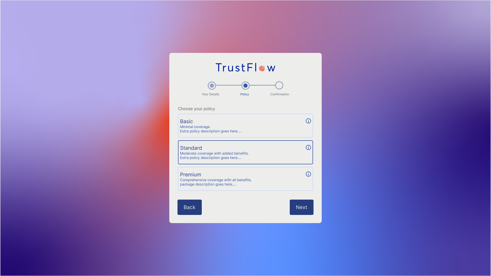

# TrustFlow Multi-Step Registration Form

This project is a responsive, multi-step registration form designed to guide users through selecting an insurance policy. Built with React, Material UI and Next.js, it follows TrustFlow’s design system for an intuitive and visually cohesive user experience.

## Design

The form design aligns with TrustFlow's brand guidelines, featuring a cohesive color scheme and UI components consistent with TrustFlow’s design language. Screenshots of the form’s layout and style can be viewed below:

- 
- 
- 

## Features

- Multi-step form for gathering user information and selecting an insurance policy
- Responsive design optimized for both desktop and mobile
- Clear visual feedback and progress indicators
- User Input validation

## Getting Started

### Prerequisites

Ensure you have [Node.js](https://nodejs.org/) installed on your machine.

### Clone the Repository

```bash
git clone https://github.com/johannawad/trustflow-app.git

```

### Install Dependencies

```bash
npm install
```

### Run the Development Server

```bash
npm run dev
```

The application will run on http://localhost:3000/

### To build

```bash
npm run build
```
